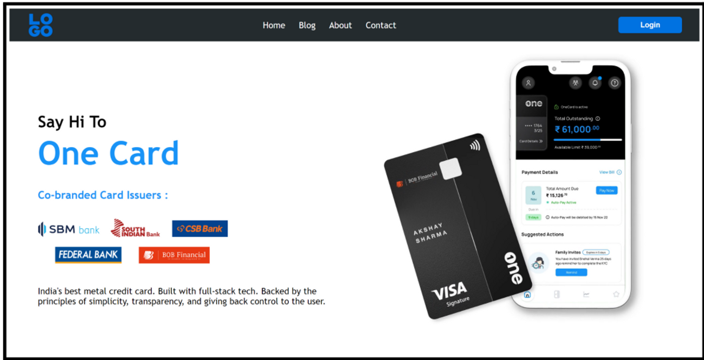
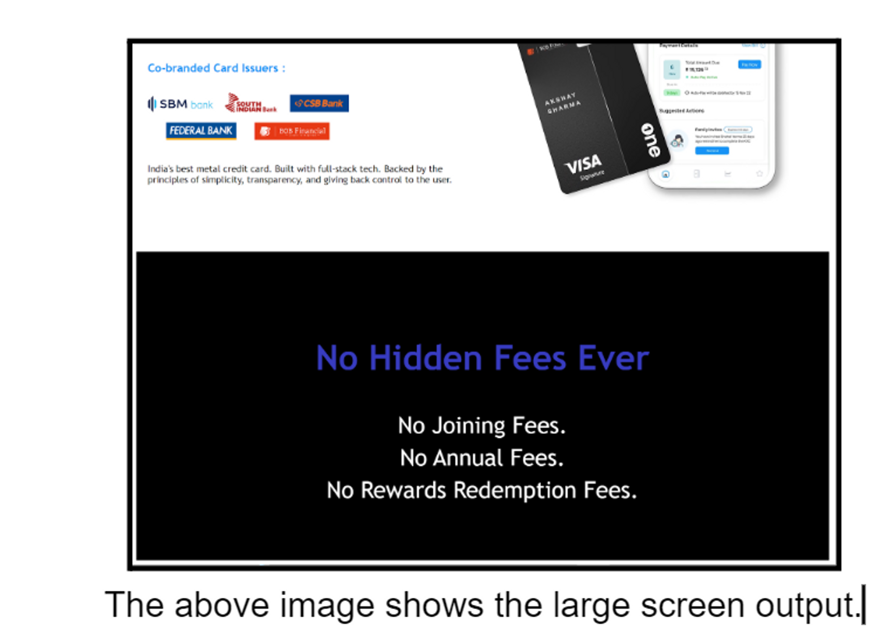
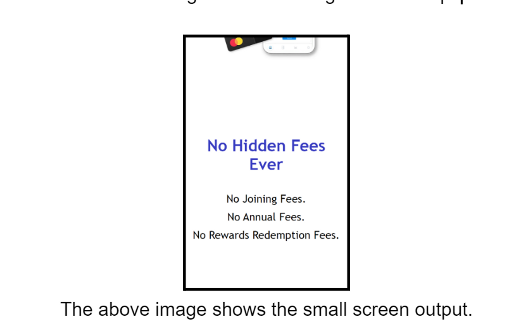
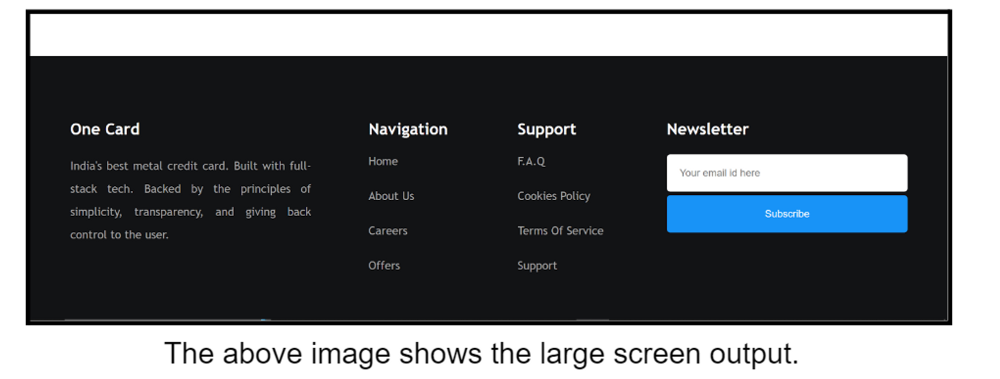
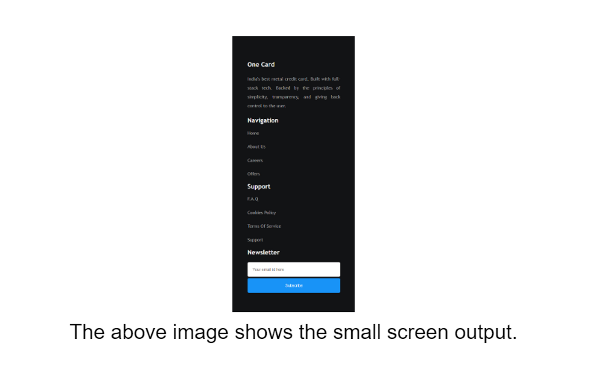
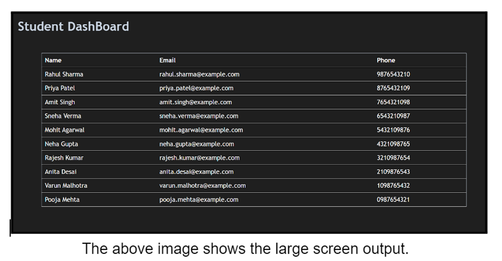
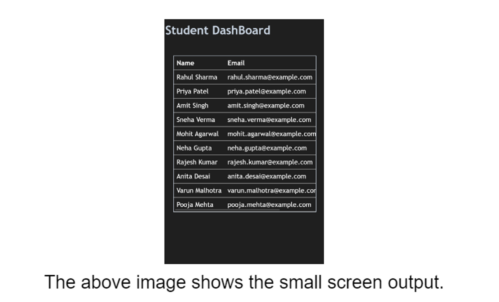

## 1. What is a Media Query in CSS, and what is its purpose?


A media query in CSS is a feature that allows you to apply different styles to a webpage based on specific conditions such as the characteristics of the device or the viewport it is being viewed on. It allows you to create responsive designs that adapt to different screen sizes, resolutions, and device capabilities.

The purpose of media queries is to provide a way to customize the layout and presentation of a webpage depending on the context in which it is being displayed. By using media queries, you can create styles that are tailored to different devices, such as desktop computers, laptops, tablets, or mobile phones. This helps ensure that your website or application looks and functions optimally across a wide range of devices and screen sizes.

Media queries are written using the @media rule in CSS. Here's an example of a media query that targets screens with a maximum width of 600 pixels:

```
@media (max-width: 600px) {
  /* CSS styles for screens with a maximum width of 600px */
  body {
    font-size: 14px;
  }

  .container {
    width: 90%;
  }
}

```
In this example, the CSS styles within the media query will only be applied when the maximum width of the viewport is 600 pixels or less. Inside the media query block, you can write CSS rules just like you would outside of a media query, but they will only take effect when the specified conditions are met.

Media queries can be used to target various features of a device, including screen size, resolution, aspect ratio, orientation (portrait or landscape), and more. By using different media queries with appropriate conditions, you can create a responsive design that adapts to different devices and provides an optimal user experience.

## 2. How do you define a media query in CSS?

In CSS, you define a media query using the @media rule. Here's the general syntax for creating a media query:

```
@media mediaType and (mediaFeature) {
  /* CSS rules to apply when the media query conditions are met */
}

```
Let's break down the components of a media query:

* @media: This keyword indicates that you're defining a media query.
* mediaType: It specifies the type of media the query targets. Common media types include all, screen, print, speech, etc. The screen media type is commonly used for targeting devices with screens, such as computers, tablets, and smartphones.
* and: It's a logical operator used to combine multiple media features within a media query.
mediaFeature: It represents a specific characteristic of the device or viewport you want to target. Media features include width, height, max-width, orientation, aspect-ratio, and many more.
Here's an example of a media query that targets screens with a maximum width of 600 pixels:
```
@media (max-width: 600px) {
  /* CSS rules for screens with a maximum width of 600px */
  body {
    font-size: 16px;
  }
}

```
In this example, the media query is defined using the max-width media feature. It specifies that the enclosed CSS rules should be applied when the maximum width of the viewport is 600 pixels or less. Inside the media query block, you can write any CSS rules that you want to be applied under the specified conditions.

Media queries can be as simple or as complex as needed, allowing you to target specific device characteristics and create responsive designs that adapt to different screen sizes and capabilities.

## 3. Explain the concept of Breakpoints in Responsive Web Design and How They are used in Media Queries.

In responsive web design, breakpoints are specific points or ranges of viewport widths where the layout of a web page needs to change in order to provide an optimal user experience. These breakpoints help in adapting the design and layout of the website to different screen sizes and devices.

Breakpoints are defined using media queries in CSS. They are used to apply different CSS rules and styles based on the viewport width or other characteristics of the device. By specifying breakpoints in media queries, you can create a responsive design that adjusts and rearranges content to fit different screen sizes.

Here's an example of how breakpoints can be used in media queries:
```
/* Styles for mobile devices */
@media (max-width: 767px) {
  /* CSS rules for small screens */
  /* e.g., rearrange layout, adjust font sizes, hide certain elements */
}

/* Styles for tablets and small laptops */
@media (min-width: 768px) and (max-width: 1023px) {
  /* CSS rules for medium screens */
  /* e.g., change column layout, increase font sizes, modify padding */
}

/* Styles for larger screens */
@media (min-width: 1024px) {
  /* CSS rules for large screens */
  /* e.g., display content in multiple columns, use larger font sizes */
}

```
In this example, there are three breakpoints defined using media queries:

1. Mobile devices: The first media query targets devices with a maximum width of 767 pixels. It applies CSS rules specific to small screens, such as rearranging the layout, adjusting font sizes, or hiding certain elements.

2. Tablets and small laptops: The second media query applies to devices with a minimum width of 768 pixels and a maximum width of 1023 pixels. It specifies CSS rules for medium-sized screens, allowing you to make further adjustments to the layout, typography, or spacing.

3. Larger screens: The final media query applies to devices with a minimum width of 1024 pixels. It sets CSS rules for large screens, which could involve displaying content in multiple columns, using larger font sizes, or utilizing more whitespace.

By using breakpoints and media queries, you can create a responsive design that adapts gracefully to various screen sizes and devices, ensuring an optimal user experience across different platforms. It allows your website to be easily accessible and usable on desktop computers, laptops, tablets, and smartphones.

## 4. What is the purpose of using Media Queries for Print Media?

The purpose of using media queries for print media is to apply specific styles and formatting when a web page is printed. Media queries allow you to customize the appearance of the printed version of a webpage, optimizing it for paper or other print media.

When users print a webpage, they often have different requirements and expectations compared to viewing it on a screen. Print media queries enable you to control how the content is presented on paper, ensuring legibility, readability, and a more pleasant printing experience.

Here are some common use cases and purposes of media queries for print media:

Page layout: Media queries allow you to modify the layout of the printed page, such as adjusting margins, page breaks, or page orientation (portrait or landscape). You can control the spacing between elements, determine the number of columns, or rearrange content for better presentation on paper.

Font sizes and typography: Print media queries enable you to specify different font sizes, line heights, and font families for the printed version. This ensures that the text is readable and clear when printed, as screen-optimized styles may not always translate well to paper.

Backgrounds and colors: Media queries can be used to remove or modify background colors, images, gradients, or other visual effects that may not be suitable for printing. This helps to conserve ink and ensures the content is more easily readable when printed in black and white.

Hiding or showing elements: You can use media queries to hide or show specific elements in the printed version. For example, you might choose to exclude navigation menus, sidebars, or advertisements that are irrelevant or unnecessary in a printed document.

Here's an example of a media query targeting print media:

```
@media print {
  /* CSS rules for print media */
  body {
    font-size: 12pt;
    line-height: 1.5;
    margin: 1cm;
  }

  .header, .footer {
    display: none;
  }
}

```

In this example, the media query with @media print targets the print media type. It sets specific styles for printing, such as adjusting the font size and line height to improve readability on paper. It also removes the .header and .footer elements from the printed version by setting their display property to none.

By utilizing media queries for print media, you can tailor the presentation of your web content when it's printed, ensuring it retains its quality and readability in the physical format.

## 5. What is the purpose of the orientation media feature?

The purpose of the orientation media feature is to target and apply different styles based on the orientation of the device or viewport. It allows you to customize the layout and presentation of a webpage depending on whether the device is in a portrait or landscape orientation.

The orientation media feature is often used in conjunction with media queries to create responsive designs that adapt to different screen orientations. By utilizing this feature, you can optimize the display of content based on the available screen space and the user's preferred orientation.

Here's an example of how the orientation media feature can be used in a media query:

```
@media (orientation: portrait) {
  /* CSS rules for portrait orientation */
  /* e.g., adjust layout, font sizes, or spacing */
}

@media (orientation: landscape) {
  /* CSS rules for landscape orientation */
  /* e.g., rearrange elements, increase column width, or modify padding */
}

```
In this example, there are two media queries that target different orientations:

1. Portrait orientation: The first media query applies CSS rules specific to devices in a portrait orientation. It allows you to make adjustments to the layout, font sizes, spacing, or any other styles that are optimized for a vertically-oriented screen.

2. Landscape orientation: The second media query applies CSS rules specific to devices in a landscape orientation. It enables you to rearrange elements, increase column width, modify padding, or perform any other necessary modifications to ensure an optimal layout for horizontally-oriented screens.

By using the orientation media feature, you can tailor the design and layout of your webpage to provide an optimal user experience based on the device's orientation. This flexibility allows your content to adapt and look visually appealing regardless of whether the user holds their device in portrait or landscape mode.

## 6. Imagine you are a web developer working for a creative agency that specializes in building visually appealing and interactive websites. The agency has recently received a client request to create a landing page similar to the design of the one-page website: https://www.getonecard.app/. The client wants to showcase a video prominently on the page to engage visitors.

Your task is to create a simple webpage that replicates the one-page landing page design, including a responsive layout and an HTML video. The below images are for your reference. Some browsers don’t allow you to play videos without the controls attribute. So, you can add controls here, we will learn how to play a video without the controls attribute in the later sections.



[]()

## 7. You are tasked with building a webpage that displays an image gallery using a grid layout. The challenge is to ensure the gallery is visually appealing and functional on both large and small screens. On large screens, the gallery should display multiple images per row, while on small screens, it should collapse into a single column for optimal viewing. Refer to the attached images for visual reference. Implement this using CSS Grid and media queries for responsiveness.


Answer larger screen output


Answer Smaller screen output


[click here for code](https://github.com/Gaurav-Dev24/Pre-Placement-Training/tree/main/Core%20Module%20Assignment/Assignment%203/Q7)

## 8. In this coding challenge, your task is to create an information section for the previously built OneCard webpage clone, focusing on the different modes like dark and light modes. The webpage should look different depending on the screen size: dark mode for larger screens and light mode for smaller devices. The reference images are attached below.


[click here for webpage]()

## 9. You have reached the final task of learning responsive web design, which involves designing a responsive footer. Your goal is to build a simple webpage footer that matches the design shown in the attached image. The footer should adapt to different screen sizes, ensuring optimal visibility and alignment of the content. Refer to the attached image for a visual reference.


[click here for webpage]()

## 10. You have been given to create a student dashboard page that includes a student details table. The challenge lies in handling the table's display on different screen sizes. On large screens, the table should be fully visible, while on small screens, it should have an internal scroll to ensure proper visibility of information. Refer to the attached images for visual reference.


[click here for webpage]()
